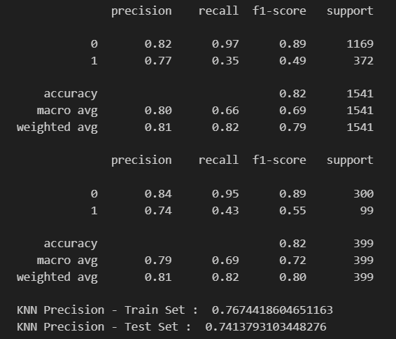

# Credit-Card-Payment-Detection
This repository contains an supervised machine learning to predict whether the customer will pay their credit card bills or not for the next month. The project is designed to help the credit card issuer to decide whether the customer is eligible for additional facilities.

## Project Overview
Credit Card Payment Detection project aims to predict wether the customer will pay their credit card bills or not for the next month based on their invoice and payment history with `Classification Alrgorithm`. By analyzing the customer invoice and payment history, the project can help credit card issuer to decide if their customer are eligible for additional facility or not. The project involves exploratory data analysis, data cleaning & preprocessing, feature engineering, model training & evaluation and model improvement.

## Tools and Technologies
- Python
- Jupyter Notebook
- Pandas
- Matplotlib
- Seaborn
- Scikit-learn

## File Description
- `CC_Payment_Detection.ipynb` : Jupyter Notebook containing the code used for data cleaning, exploratory data analysis, feature engineering, model training & evaluation and model improvement.
- `CC_Payment_Detection_Inference.ipynb` : Jupyter Notebook containing the code for model inference testing.
- `credit_card_data.csv` : CSV file containing the data of Credit Card Payment History.
- `deployment/` : Folder containing the code for model deployment.
- `images/` : Folder containing images result.

## Algorithm Used
- Logistic Regression
- K-Nearest Neighbors Classifier
- Support Vector Machines Classifier

## Result
  
Above are the result of KNN algorithm after parameter tuning and threshold change.  
To analyze this model, we use `precision` metrics because we want to maximize the model to correctly predict positive and minimalize false positive.

## Conclusion
Credit Card Payment Detection project was able to successfully classify the customer payment status for the next month with `76.7% Precision Score` using `KNN` algorithm. These can be used by credit card issuer to help them to evaluate their customer and decide whether the customer is eligible for additional facilities.

## Acknowledgements
The Credit Card Payment History data used in this project was obtained from [Google BigQuery](https://console.cloud.google.com/bigquery?p=ftds-hacktiv8-project&d=phase1_ftds_001_sby&t=credit-card-information&page=table)

Model Deployment for this project on [Hugging Face](https://huggingface.co/spaces/gilangw/credit_card_customer_classification)
